# FDA Drug Adverse Event Signal Detection & Pharmacovigilance Analysis
## Identifying Safety Signals Across High-Volume Pharmaceutical Products | January 2022 to April 2025

---

## Project Overview
This project applies pharmacovigilance methodology to the FDA Adverse Event
Reporting System (FAERS) to detect drug safety signals across five high volume
pharmaceutical products: Aspirin, Ibuprofen, Paracetamol, Metformin and
Atorvastatin. Using the Reporting Odds Ratio (ROR), the industry standard
signal detection method used by regulatory data teams at major pharmaceutical
organisations, this project identifies statistically elevated adverse event
patterns, temporal trends, demographic risk profiles and drug specific reaction
signatures across 6,000 adverse event reports covering January 2022 to
April 2025.

---

## Objectives
- Assess the distribution of serious, fatal and hospitalisation adverse events across five pharmaceutical products
- Analyse patient demographic profiles including age group and sex distribution
- Identify the most frequently reported adverse reactions across all products combined
- Track serious event and death rate trends across the 2022 to 2025 period
- Examine the geographical distribution of adverse event reporting
- Compare serious event and death rates across all five pharmaceutical products
- Assess disabling and life threatening event rates by drug
- Identify drug specific adverse reaction profiles for each product
- Detect pharmacovigilance safety signals using Reporting Odds Ratio methodology
- Analyse age and sex interaction effects on serious event rates
- Present findings in a comparative drug heatmap and summary scorecard
- Execute 15 SQL analytical queries against a PostgreSQL 16 database
- Present key findings in an interactive Power BI dashboard

---

## Data Source
| | |
|---|---|
| **Publisher** | U.S. Food and Drug Administration |
| **Dataset** | FDA Adverse Event Reporting System (FAERS) |
| **Access** | openFDA API (open.fda.gov/apis/drug/event) |
| **Coverage** | January 2022 to April 2025 |
| **Records** | 6,000 adverse event reports across five pharmaceutical products |
| **Frequency** | Quarterly updates |
| **Licence** | Public domain CC0 |

---

## Tools and Libraries
| Tool | Purpose |
|---|---|
| Python 3.12 | Core programming language |
| pandas | Data manipulation and transformation |
| numpy | Statistical calculations |
| matplotlib | Data visualisation |
| seaborn | Statistical visualisation and heatmaps |
| scipy | Signal detection statistics |
| requests | openFDA API data retrieval |
| SQLAlchemy | Python to PostgreSQL connection |
| psycopg2 | PostgreSQL database adapter |
| PostgreSQL 16 | Database storage and SQL analysis |
| Jupyter Lab | Interactive analysis environment |
| Power BI Desktop | Interactive dashboard |
| Git | Version control |

---

## Key Findings

### Serious Adverse Events
81.15% of all 6,000 adverse event reports were classified as serious.
Paracetamol recorded the highest serious event rate at 93.65% and Aspirin
recorded the lowest at 72.80%. The serious event rate increased from
80.42% in 2022 to 91.94% in 2025.

### Mortality
Ibuprofen recorded the highest death rate at 20.50%. Metformin recorded
the second highest at 13.10%. Paracetamol recorded the lowest death rate
at 5.05% despite having the highest serious event rate. The death rate
declined from 11.00% in 2022 to 8.40% in 2024 before increasing to
12.90% in 2025.

### Hospital Admissions
Atorvastatin recorded the highest hospitalisation rate at 40.80%.
Metformin recorded the second highest at 40.40%. Paracetamol recorded
the lowest hospitalisation rate at 25.60%.

### Disabling Adverse Events
Paracetamol recorded the highest disabling event rate at 22.25%.
Ibuprofen recorded the second highest at 8.60%. Aspirin recorded the
lowest at 1.30%.

### Life Threatening Adverse Events
Paracetamol recorded the highest life threatening event rate at 5.60%.
Aspirin recorded the lowest at 3.70%. Life threatening event rates
were broadly consistent across all five drugs ranging from 3.70% to 5.60%.

### Death Rate Trend
The death rate declined from 11.00% in 2022 to 8.40% in 2024. The death
rate increased to 12.90% in 2025, a rise of 4.50 percentage points from
2024. This represents the largest single year on year change in the dataset.

### Pharmacovigilance Signal Detection
The Reporting Odds Ratio (ROR) was used to identify statistically elevated
drug reaction combinations. The following signals were identified:

Paracetamol: Drug withdrawal syndrome with ROR 777.39
Paracetamol: Drug dependence with ROR 176.88
Paracetamol: Emotional distress with ROR 149.22
Paracetamol: Overdose with ROR 20.95
Metformin: Lactic acidosis with ROR 49.34
Metformin: Blood glucose increased with ROR 10.91
Ibuprofen: Joint swelling with ROR 8.25
Ibuprofen: Hypersensitivity with ROR 7.97
Ibuprofen: Rash with ROR 7.05
Aspirin: Anaemia with ROR 3.80
Aspirin: Constipation with ROR 2.46
Atorvastatin: Fall with ROR 2.27

### Paracetamol and Opioid Combination Products
The Paracetamol reaction profile was dominated by Drug dependence at 989
reports, Drug withdrawal syndrome at 560 reports and Overdose at 385
reports. Drug withdrawal syndrome recorded the highest ROR in the entire
dataset at 777.39. These reactions are not typical of plain paracetamol.

### Patient Age
Patients aged 85 and over recorded the highest serious event rates —
Female 93.75% and Male 87.32%. Patients aged 65 to 84 made up the largest
known age group at 1,534 records. Serious event rates increased with age
across both sexes. 39.73% of records had no age recorded.

### Patient Sex
Female patients accounted for 51.88% of reports and male patients 48.12%.
Female patients dominated the 18 to 44 age group with 410 reports compared
to 169 male reports. Male patients recorded higher serious event rates than
female patients in the Under 18 and 45 to 64 age groups.

### Top Adverse Reactions
The five most frequently reported adverse reactions across all drugs were
Pain at 1,337 reports, Emotional distress at 1,014, Drug dependence at
1,011, Drug withdrawal syndrome at 562 and Fatigue at 453.

### Reporting Countries
The United States accounted for 54.79% of all reports. Canada ranked
second at 9.01%. The United Kingdom ranked third at 6.29%.

### Data Completeness
39.73% of records had no patient age recorded. 7.87% had no patient sex
recorded. 5,017 of 6,000 records were submitted in January 2022,
representing 83.6% of all 2022 records.

---

## Analyses
| # | Analysis | Tool | Description |
|---|---|---|---|
| 1 | Data Acquisition | Python | Adverse event data retrieved from openFDA API for five pharmaceutical products |
| 2 | Data Parsing | Python | Raw JSON parsed into structured DataFrame of 6,000 records across 16 fields |
| 3 | Data Quality Assessment | Python | Missing values, distributions and data completeness assessed |
| 4 | Data Cleaning | Python | Date conversion, label mapping, age group assignment and feature engineering |
| 5 | Serious Event Distribution | Python and SQL | Serious vs non-serious event distribution overall and by drug |
| 6 | Death Reports | Python and SQL | Fatal adverse event counts and death rates by drug |
| 7 | Hospitalisation Analysis | Python and SQL | Hospitalisation counts and rates by drug |
| 8 | Sex Distribution | Python and SQL | Adverse event reports analysed by patient sex overall and by drug |
| 9 | Age Group Distribution | Python and SQL | Adverse event reports distributed across age groups |
| 10 | Top 20 Adverse Reactions | Python | Most frequently reported reactions across all five drugs combined |
| 11 | Yearly Trend Analysis | Python and SQL | Serious event and death rates tracked from 2022 to 2025 |
| 12 | Country Distribution | Python and SQL | Top 15 reporting countries by adverse event volume |
| 13 | Serious Event Rate by Drug | Python and SQL | Serious event and death rates compared across all five drugs |
| 14 | Disabling and Life Threatening Rates | Python and SQL | Disabling and life threatening event rates by drug |
| 15 | Drug Specific Reaction Profiles | Python | Top 5 reactions identified for each pharmaceutical product |
| 16 | ROR Signal Detection | Python and SQL | Reporting Odds Ratio calculated for top drug reaction combinations |
| 17 | Age and Sex Interaction | Python and SQL | Serious event rates analysed by combined age group and sex |
| 18 | Drug Comparison Heatmap | Python | All key adverse event metrics visualised in a single heatmap |
| 19 | Summary Scorecard | Python | Consolidated scorecard of all metrics across all five drugs |
| 20 | Month on Month Change | SQL | Monthly reporting volumes tracked using LAG window function |
| 21 | Comprehensive Drug Safety Summary | SQL | All serious event metrics combined in a single SQL query |
| 22 | Yearly Death Rate Trend | SQL | Annual death rates tracked with year on year change using LAG |

---

## How to Run

### Prerequisites
- Python 3.8 or higher
- PostgreSQL 14 or higher
- Power BI Desktop — powerbi.microsoft.com/desktop
- Jupyter Lab

### 1. Clone the Repository
```bash
git clone git@github.com:Kingsley-Eboh/fda-adverse-events-analysis.git
cd fda-adverse-events-analysis
```

### 2. Install Dependencies
```bash
pip install pandas numpy matplotlib seaborn scipy requests sqlalchemy psycopg2-binary jupyter
```

### 3. Get an openFDA API Key
Register for a free API key at open.fda.gov/apis/authentication and replace
YOUR_API_KEY_HERE in the notebook with your key before running.

### 4. Set Up PostgreSQL
Create a local PostgreSQL database and user. Update the connection string in
the Section 6 data load cell with your credentials before running.

### 5. Run the Notebook
Launch Jupyter Lab and open fda_adverse_events_analysis.ipynb:
```bash
jupyter lab
```
Select Kernel → Restart and Run All Cells to execute all cells in sequence.

### 6. Run the SQL Queries
Once the database is populated execute the analytical queries:
```bash
psql -U your_user -d portfolio -h localhost -f sql/fda_adverse_events_queries.sql
```

### 7. Open the Power BI Dashboard
Open powerbi/fda_dashboard.pbix in Power BI Desktop and reconnect to your
local PostgreSQL instance using your configured credentials when prompted.

---

## Evidence

### Analysis 1 — Serious vs Non-Serious Events
[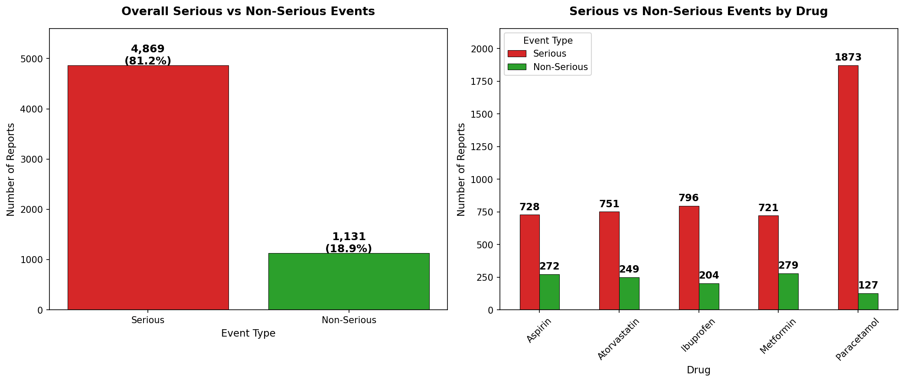](figures/analysis1_serious_events.png)

### Analysis 2 — Death Reports by Drug
[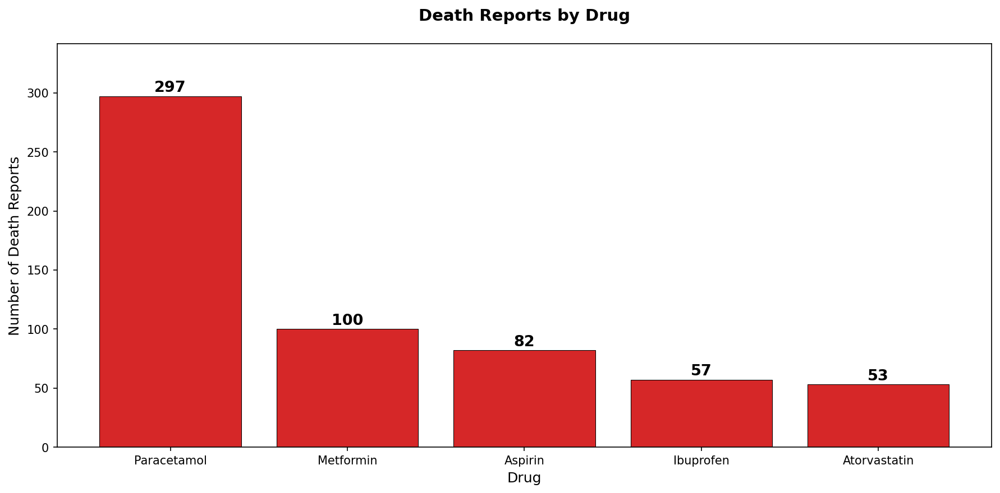](figures/analysis2_death_reports.png)

### Analysis 3 — Hospitalisation Reports by Drug
[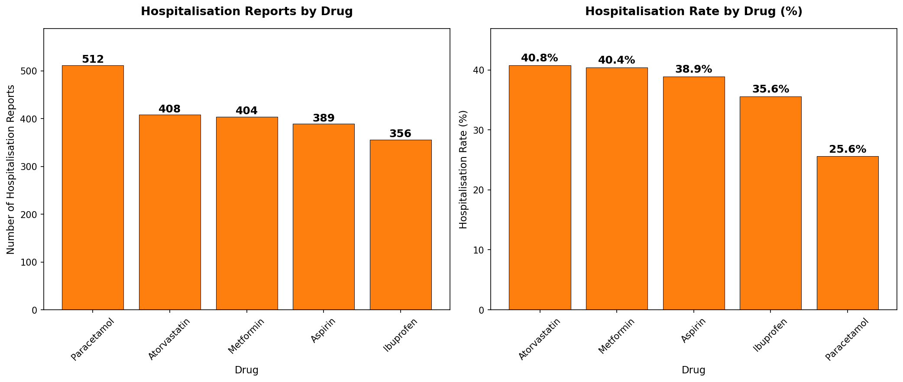](figures/analysis3_hospitalisation.png)

### Analysis 4 — Patient Sex Distribution
[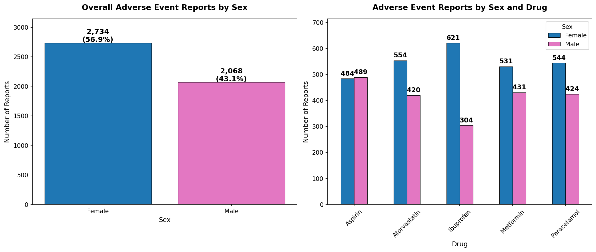](figures/analysis4_sex_distribution.png)

### Analysis 5 — Age Group Distribution
[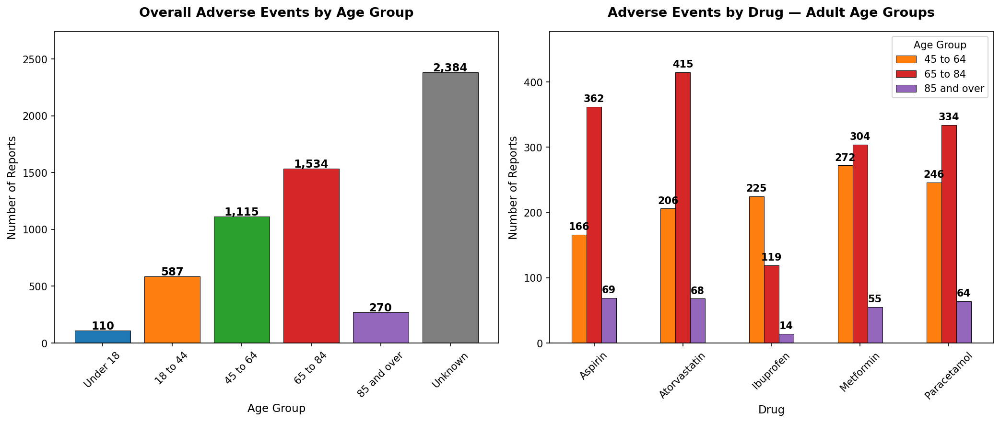](figures/analysis5_age_distribution.png)

### Analysis 6 — Top 20 Most Reported Reactions
[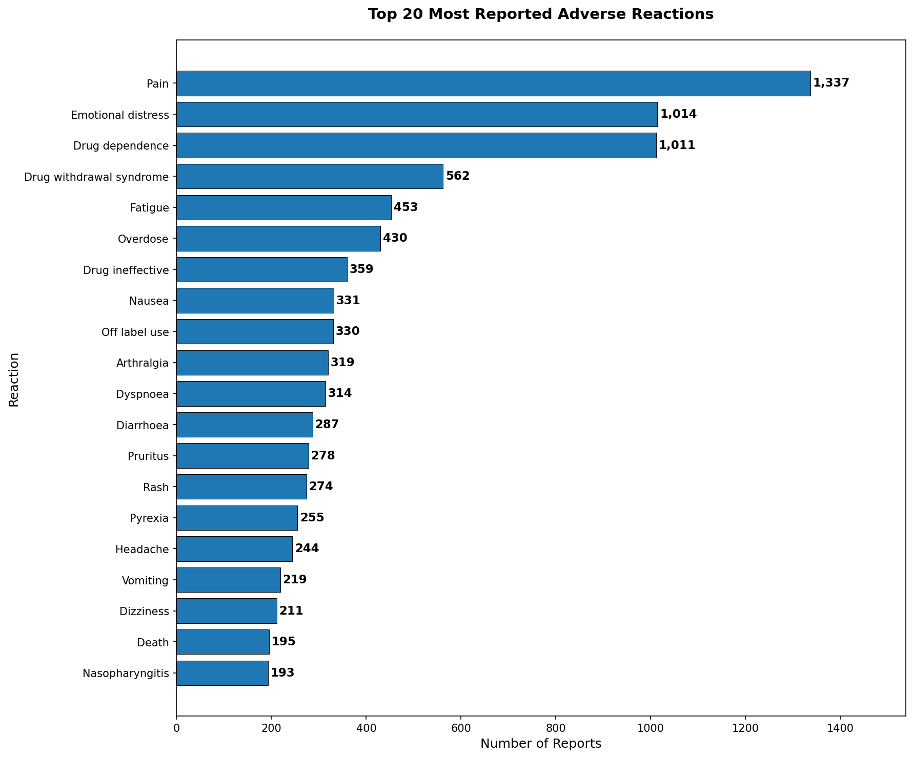](figures/analysis6_top_reactions.png)

### Analysis 7 — Serious Event and Death Rate Trends
[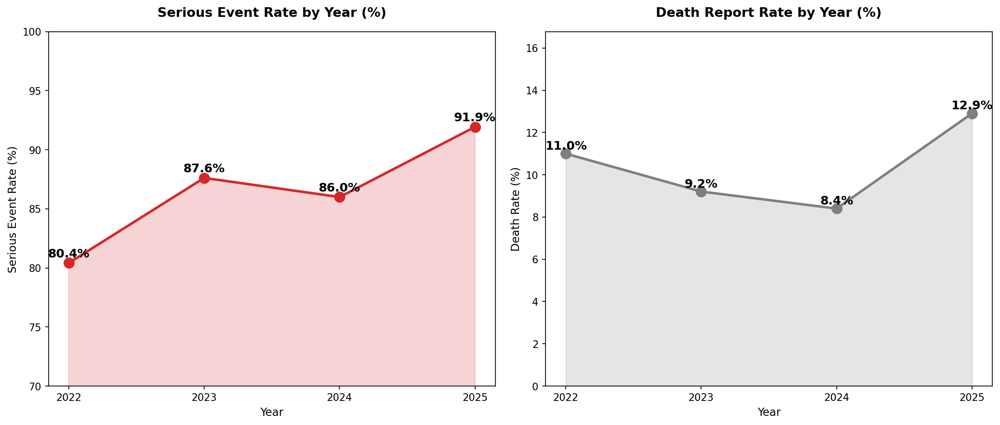](figures/analysis7_yearly_trend.png)

### Analysis 8 — Top 15 Reporting Countries
[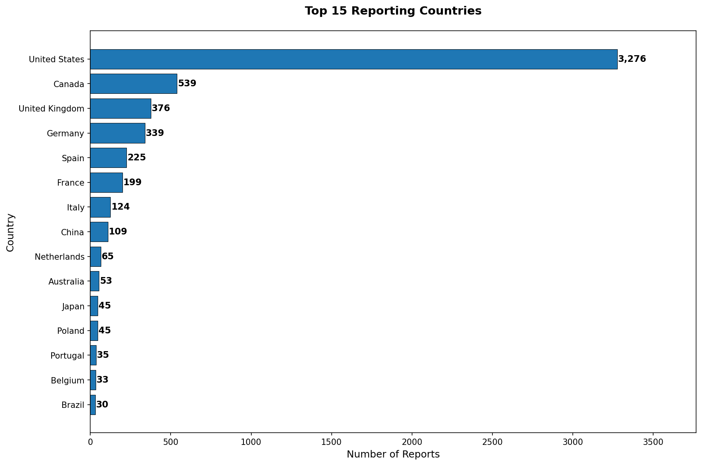](figures/analysis8_country_distribution.png)

### Analysis 9 — Serious Event Rate by Drug
[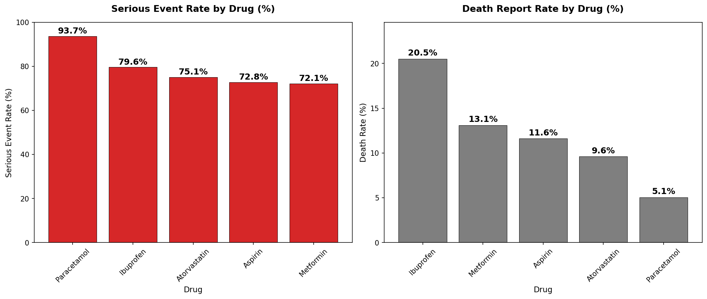](figures/analysis9_serious_rate_by_drug.png)

### Analysis 10 — Disabling and Life Threatening Rates
[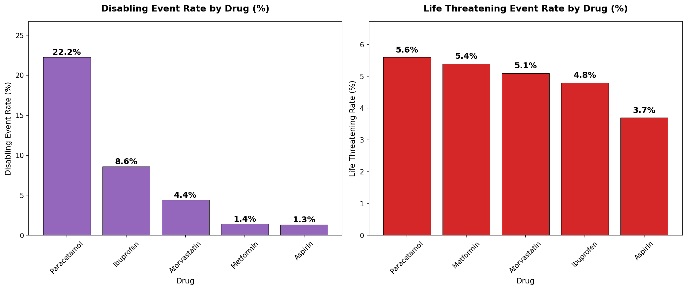](figures/analysis10_disabling_lifethreat.png)

### Analysis 11 — Drug Specific Reaction Profiles
[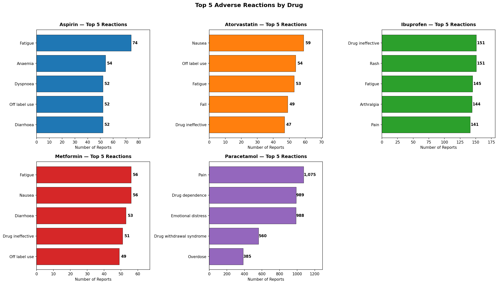](figures/analysis11_reactions_by_drug.png)

### Analysis 12 — ROR Signal Detection
[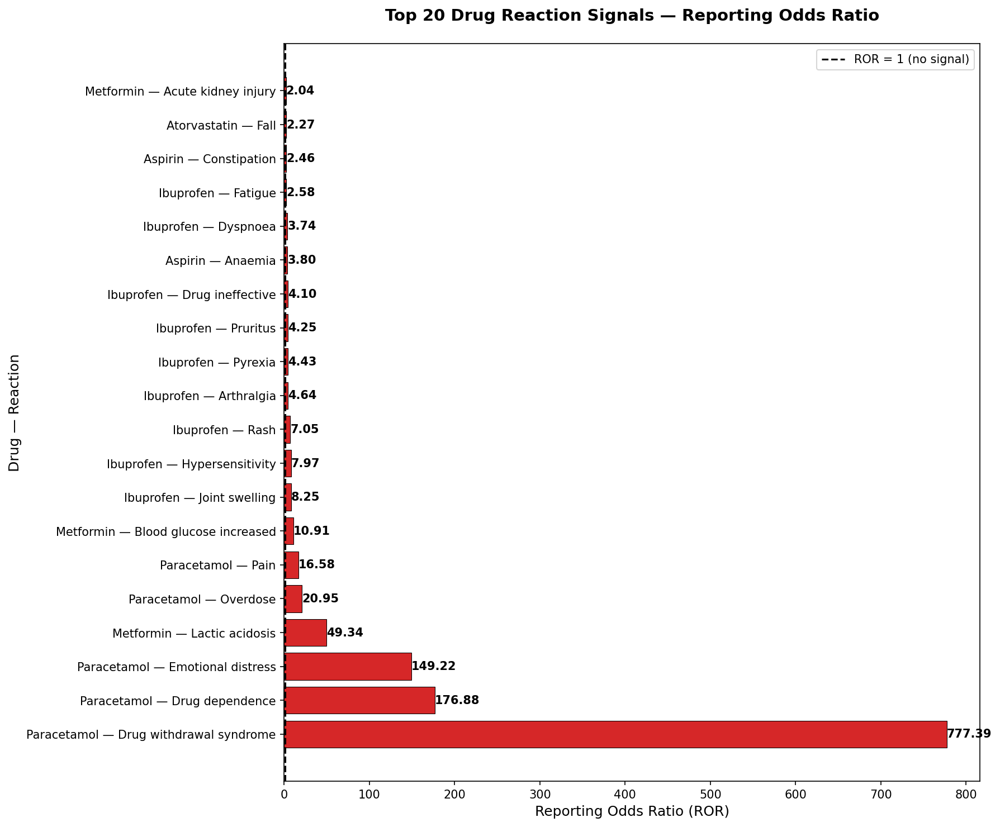](figures/analysis12_ror_signals.png)

### Analysis 13 — Age and Sex Interaction
[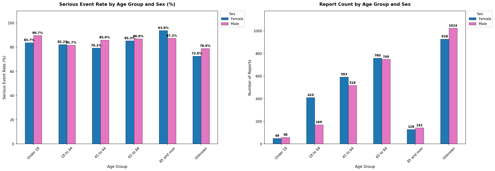](figures/analysis13_age_sex_interaction.png)

### Analysis 14 — Drug Comparison Heatmap
[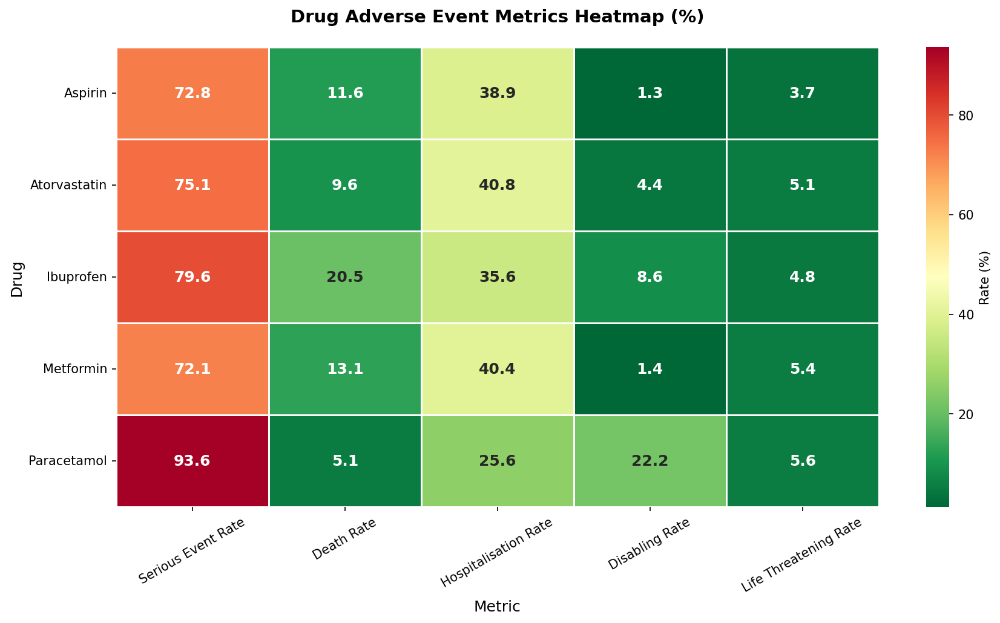](figures/analysis14_drug_heatmap.png)

### Analysis 15 — Summary Scorecard
[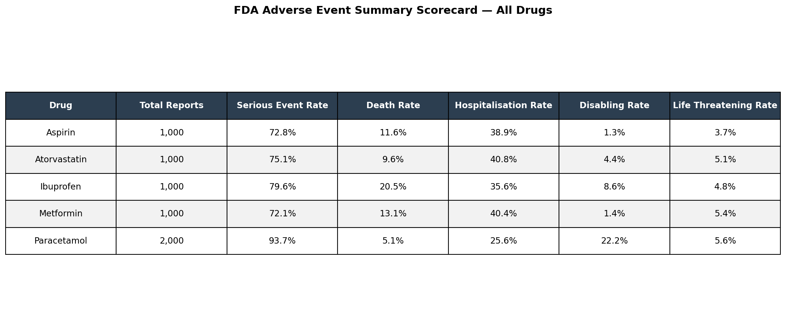](figures/analysis15_summary_scorecard.png)

### Power BI Dashboard — Executive Summary
[](powerbi/fda_adverse_events_dashboard.pdf)

---

## Project Structure

```
fda-adverse-events-analysis/
├── fda_adverse_events_analysis.ipynb    # Main analysis notebook
├── figures/
│   ├── analysis1_serious_events.png
│   ├── analysis2_death_reports.png
│   ├── analysis3_hospitalisation.png
│   ├── analysis4_sex_distribution.png
│   ├── analysis5_age_distribution.png
│   ├── analysis6_top_reactions.png
│   ├── analysis7_yearly_trend.png
│   ├── analysis8_country_distribution.png
│   ├── analysis9_serious_rate_by_drug.png
│   ├── analysis10_disabling_lifethreat.png
│   ├── analysis11_reactions_by_drug.png
│   ├── analysis12_ror_signals.png
│   ├── analysis13_age_sex_interaction.png
│   ├── analysis14_drug_heatmap.png
│   └── analysis15_summary_scorecard.png
├── sql/
│   └── fda_adverse_events_queries.sql   # All 15 SQL queries
├── powerbi/
│   ├── fda_adverse_events.csv           # Exported dataset for Power BI
│   ├── fda_adverse_events_dashboard.pbix  # Power BI dashboard file
│   └── fda_adverse_events_dashboard.pdf   # Exported dashboard PDF
├── .gitignore
└── README.md
```
---

## Author
**Kingsley Eboh**
[GitHub](https://github.com/Kingsley-Eboh)

---
*Data sourced from the FDA Adverse Event Reporting System via the openFDA API. This project is intended for portfolio and educational purposes.*
